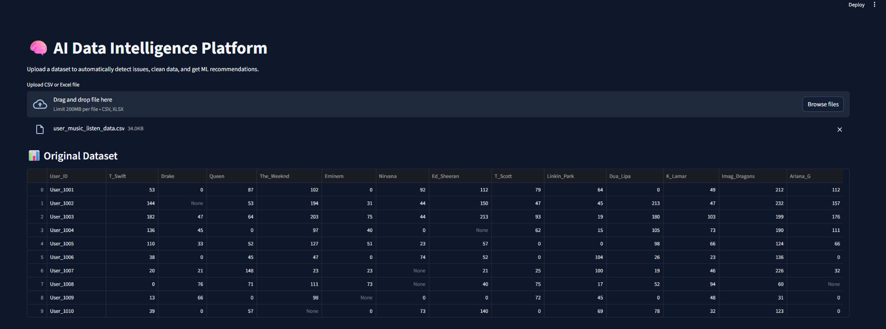
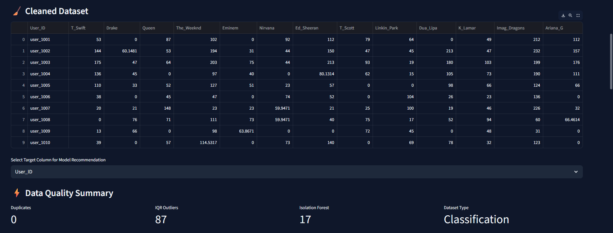
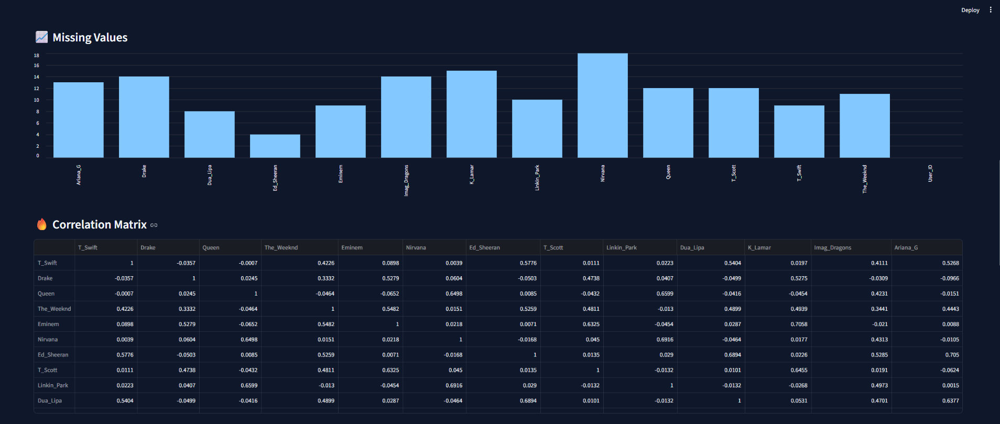
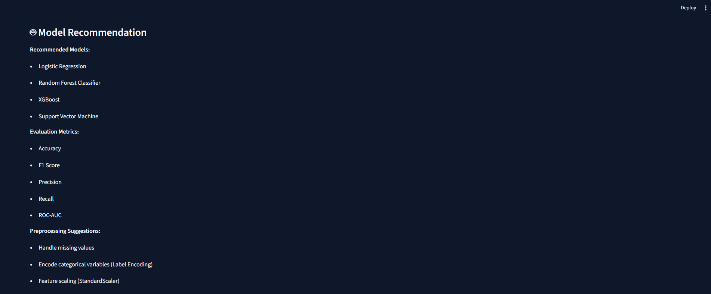
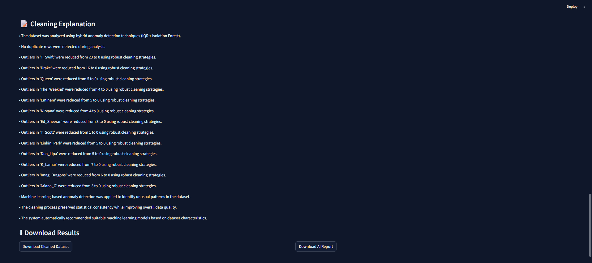

# AI Data Intelligence Platform

An AI-powered system that automatically detects data issues, cleans datasets, and recommends machine learning models.

## Features

- Automated data cleaning
- Missing value detection
- Outlier detection using IQR
- Anomaly detection using Isolation Forest
- Dataset type detection
- Machine learning model recommendation
- Interactive Streamlit dashboard
- Download cleaned dataset
- Generate AI analysis report

## Agent-Based Architecture

The system follows a modular agent-based design, where each component is responsible for a specific task in the data processing pipeline.

Agents included:

Issue Detector Agent → Detects missing values, duplicates, and anomalies

Strategy Agent → Decides the best cleaning strategy

Cleaning Agent → Applies the cleaning operations

Validation Agent → Validates cleaned data quality

Explanation Agent → Generates insights explaining the cleaning process

Dataset Analyzer Agent → Identifies dataset type

Model Recommender Agent → Suggests suitable ML models and evaluation metrics

## Tech Stack

- Python
- Streamlit
- Pandas
- Scikit-learn
- ReportLab

## Installation

Clone the repository:

git clone https://github.com/vasundrasriravi/AI-Data-Intelligence-Platform.git

Move into the project directory:

cd AI-Data-Intelligence-Platform

Install dependencies:

pip install -r requirements.txt

## Run the Application

Start the Streamlit dashboard:

streamlit run app.py

Then open the browser link shown in the terminal.

## Example Workflow

1️⃣ Upload a dataset (CSV or Excel)
2️⃣ System detects data quality issues automatically
3️⃣ Cleaning strategies are applied
4️⃣ Cleaned dataset is generated
5️⃣ AI suggests machine learning models
6️⃣ Download cleaned dataset and AI report

## Output

The platform provides:

Data quality summary

Missing value visualization

Correlation analysis

Model recommendations

AI-generated data cleaning explanations
Downloadable cleaned dataset
Downloadable AI analysis report

